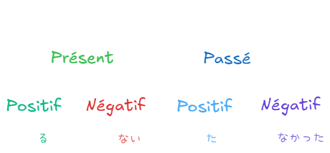
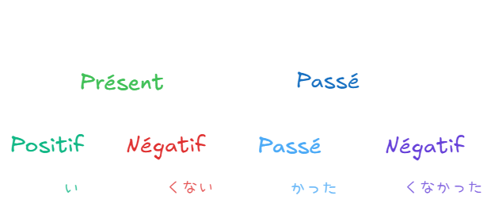
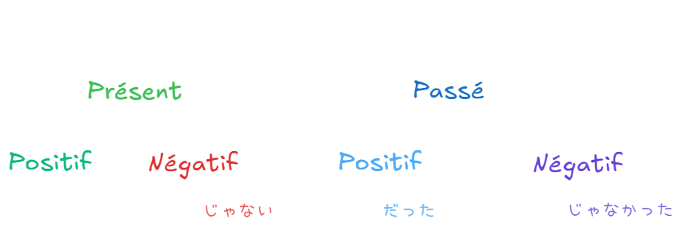
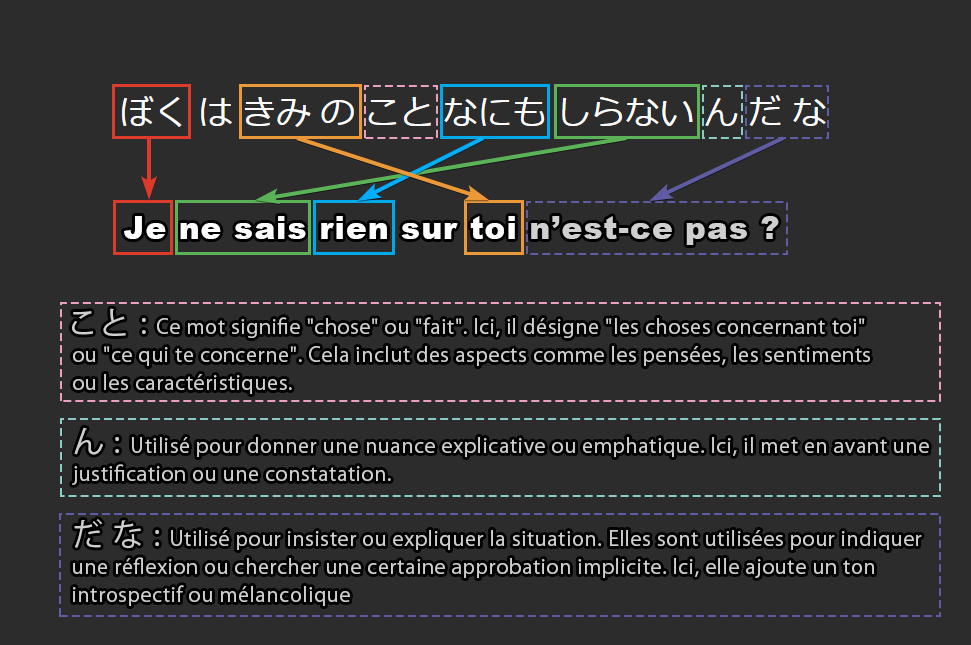

## **Introduction**
Ce post ne contient pas de définitions ni d’explications détaillées. Il s’agit de notes résumées, présentées sous forme de bullet point, davantage conçues comme une cheatsheet (fiche pratique) qu’un cours complet.

## **Kana**

## **Verbes**
Ressource très utile : https://www.japaneseverbconjugator.com/ & https://www.verbix.com/languages/japanese

### Types de verbes 

| **Groupe** | **Terminaisons typiques** | **Exemples** | **Caractéristiques**                                  |
| ---------- | ------------------------- | ------------ | ----------------------------------------------------- |
| ごだん        | -う, -く, -す など             | かく, のむ, はなす  | La dernière syllabe change selon la conjugaison.      |
| いちだん       | -る (après い ou え)         | たべる, みる, おきる | Le radical reste stable, seule la terminaison change. |
| ふきそく       | する, くる                    | べんきょうする, くる  | Conjugaisons spécifiques et irrégulières.             |

Descriptions :

1. <strong class="alternate">ごだん - Verbes</strong> 
	- Ces verbes se terminent en **-う, -く, -す, -つ, -ぬ, -む, -ぶ, -る** (quand **-る** n’est pas un ichidan).
	- La dernière syllabe du radical change selon la forme.
	- **Exemple :** かく (écrire) → かいて (forme -te).
	  
2. <strong class="alternate">いちだん - Verbes</strong> 
	- Ces verbes se terminent en **-る**, précédé d’un son **い** ou **え**.
	- Le radical reste identique, seule la terminaison change.
	- **Exemple :** たべる (manger) → たべて (forme -te).
	  
3. <strong class="alternate">ふきそく - Verbes</strong> 
    - Il n’y a que **する (faire)** et **くる (venir)** dans cette catégorie.
    - Leurs conjugaisons ne suivent pas les règles habituelles.
    - **Exemple :** する → して (forme -te), くる → きて (forme -te).

### Conjugaison

| **Forme Positive** | **Forme Négative**                 | **Forme Passée**                  | **Forme Passée Négative**            |
| ------------------ | ---------------------------------- | --------------------------------- | ------------------------------------ |
| いく                 | いかない  | いった  | いかなかった  |
| ねる                 | ねない   | ねた   | ねなかった   |
| のむ                 | のまない  | のんだ  | のまなかった  |
| たべる                | たべない  | たべた  | たべなかった  |
| かく                 | かかない  | かいた  | かかなかった  |
| はなす                | はなさない | はなした | はなさなかった |
| みる                 | みない   | みた   | みなかった   |
| わかる                | わからない | わかった | わからなかった |
| しぬ                 | しなない  | しんだ  | しななかった  |
| あそぶ                | あそばない | あそんだ | あそばなかった |

## **Adjectifs**
Les adjectifs se divisent en deux grandes catégories : **adjectifs en -い** et **adjectifs en -な**.

### Adjectifs en -い 
- Se terminent toujours par **-い** dans leur forme de base.
- Ils sont intrinsèquement adjectifs et peuvent être utilisés seuls sans particules.

| **Adjectif** (-い) | **Traduction** |
| ----------------- | -------------- |
| たのしい              | amusant        |
| はやい               | rapide         |
| ちいさい              | petit          |

### Adjectifs en -な 
- Ne se terminent pas par **-い** (sauf exceptions comme **きれい**).
- Nécessitent la particule **-な** pour qualifier un nom.
- Ils partagent certains traits avec les noms grammaticaux.

| **Adjectif** (-な) | **Traduction** |
| ----------------- | -------------- |
| しずかな              | calme          |
| ていねいな             | poli           |
| ゆうめいな             | célèbre        |

### Conjugaison

| **Forme Positive** | **Forme Négative**                  | **Forme Passée**                    | **Forme Passée Négative**             |
| ------------------ | ----------------------------------- | ----------------------------------- | ------------------------------------- |
| かわいい               | かわいくない | かわいかった | かわいくなかった |
| すごい                | すごくない  | すごかった  | すごくなかった  |
| おいしい               | おいしくない | おいしかった | おいしくなかった |
| あぶない               | あぶなくない | あぶなかった | あぶなくなかった |
| つよい                | つよくない  | つよかった  | つよくなかった  |

| **Forme Positive** | **Forme Négative**                    | **Forme Passée**                     | **Forme Passée Négative**               |
| ------------------ | ------------------------------------- | ------------------------------------ | --------------------------------------- |
| しんせつ               | しんせつじゃない | しんせつだった | しんせつじゃなかった |
| きれい                | きれいじゃない  | きれいだった  | きれいじゃなかった  |
| すき                 | すきじゃない   | すきだった   | すきじゃなかった   |
| だいじ                | だいじじゃない  | だいじだった  | だいじじゃなかった  |

### Transformation des adjectifs en -い en adverbes
Pour transformer un adjectif en **-い** en un **adverbe**, on remplace la terminaison **-い** par **-く**.

| **Adjectif** (-い) | **Adverbe** (-く) | **Traduction**                 |
| ----------------- | ---------------- | ------------------------------ |
| はやい (rapide)      | はやく              | rapidement                     |
| おおきい (grand)      | おおきく             | grandement / de manière grande |
| たのしい (amusant)    | たのしく             | de manière amusante            |

### Transformation des adjectifs en -な en adverbes
Pour transformer un adjectif en **-な** en un **adverbe**, on ajoute **に** après **l’adjectif**.

| **Adjectif** (-な) | **Adverbe** (に) | **Traduction** |
| ----------------- | --------------- | -------------- |
| しずかな (calme)      | しずかに            | calmement      |
| ていねいな (poli)      | ていねいに           | poliment       |

## **Particules**

**が** : marque le **sujet** de la phrase, particulièrement lorsqu'on souhaite mettre en avant une information **nouvelle ou importante**. 
> 「ねこがいる」*(Il y a un chat)*

---
**は** : prononcé wa marque le sujet de la phrase - introduit un sujet connu ou une information générale.
>「わたしはがくせいです」*(Je suis étudiant)*

---
**よ** : en fin de phrase - ajoute de l'emphase pour signaler une information nouvelle ou importante.
> 「あしたあめがふるよ」*(Il va pleuvoir demain, tu sais !)*

---
**ね** : en fin de phrase - demande l'approbation de la personne.
> 「これはおいしいね」*(C'est délicieux, n'est-ce pas ?)*

---
**な** : permet de lier des adjectifs en "na" avec un nom. 
> 「だいじなもの」*(Une chose importante)*

---
**を** : indique le COD  *(complément d'objet direct - qui désigne l'objet sur lequel une action est directement effectuée)*. 
> 「りんごをたべる」*(Je mange une pomme)*

---
**に** : sert à indiquer la direction, le lieu de destination, ou encore le point temporel (moment où quelque chose se passe). 
>- Destination : 「とうきょうにいく」 : *(Je vais à Tokyo)*
>  - Temps : 「しちじにおきる」*(Se lever à 7 heures)*

---
**へ** : indique la direction ou la destination d'un mouvement. 
> 「がっこうへいく」: *(Aller vers l'école)*

---
**で** : indique le lieu où une action se déroule, ou le moyen utilisé pour effectuer une action.
> - Lieu : 「としょかんでべんきょうする」: *(Étudier à la bibliothèque)*
>- Moyen : 「バスでいく」: *(Aller en bus)*

---
**の** : marque la **possession** ou sert à **relier deux noms** pour montrer une relation (comme un complément de nom en français).
> 「わたしのほん」_(Mon livre)_

---
**なあ** : utilisé à la fin d'une phrase pour **exprimer une émotion**, souvent de la **nostalgie**, de la **surprise**, ou un **désir**. C'est une particule qui donne un ton **contemplatif** ou **emphatique**.
> 「きょうはいいてんきだなあ」_(Quel beau temps aujourd'hui !)_

---
**と** : utilisé pour indiquer une **coordination** (comme "et" pour lister des éléments) ou une **condition** (comme "si"). Il marque également une **citation directe**.
> - Liste : 「パンとバター」_(Pain et beurre)_
> - Condition : 「まどをあけると、さむくなる」_(Si j'ouvre la fenêtre, il fera froid)_
> - Citation : 「かれが『いく』といった」_(Il a dit "je pars")_

---
**とか** : similaire à **と**, mais indique souvent des **exemples non exhaustifs** ou des éléments **possibles** parmi d'autres. Peut également indiquer une **citation indirecte**.
> 「ケーキとかクッキーがすきです」_(J'aime les gâteaux, les biscuits, etc.)_

---
**って** : utilisé pour indiquer une **citation**, une **rumeur**, ou pour poser une **question indirecte**. Il a un usage familier pour reprendre ce que quelqu'un a dit.
> 「あしたはやすみだって」_(On dit que demain est un jour de congé)_

---
**ん** : forme contractée de **の** ou de **のです**, souvent utilisée pour expliquer quelque chose ou pour **justifier** une affirmation. Elle donne un ton **explicatif** à la phrase.
> 「きのうはつかれたんです」_(J'étais fatigué hier)_

---
**か** : en fin de phrase - transforme une phrase en **question**, ou marque une **alternative** entre deux choix.
> 「これはたべものか？」*(Est-ce de la nourriture ?)*  
> 「りんごかバナナを食べますか？」*(Une pomme ou une banane ?)*

---
**し** : sert à énumérer des raisons, des faits ou des caractéristiques en suggérant qu’il pourrait y en avoir d’autres. Utilisée dans des contextes où le locuteur souhaite présenter plusieurs points pour expliquer une situation ou décrire quelque chose, souvent sans être exhaustif.
> Énumération des qualités : 「きれいだし、やさしいし」 *(Elle est belle, et en plus gentille.)*
> Justification : 「つかれているし、ねむいし、もうかえりたい」 *(Je suis fatigué(e), j’ai sommeil, alors je veux rentrer.)*

### Particules de connexion
Ces particules relient deux propositions ou clauses pour indiquer une relation logique (cause, conséquence, opposition, etc.).

| **Particule** | **Signification principale**   | **Exemple**                      | **Explication**                                 |
|---------------|--------------------------------|-----------------------------------|------------------------------------------------|
| **も**        | "aussi"                   | わたしもいきます。   | "Moi aussi, j’y vais"               |
| **から**      | "parce que", "depuis"     | あついから、まどをあけます。       | "Comme il fait chaud, j’ouvre la fenêtre."  |
| **けど**      | "mais" (forme familière)    | たかいけど、かいます。              | "C’est cher, mais je l’achète."             |
| **が**        | "mais" (forme polie)        | あめがふっていますが、いきます。   | "Il pleut, mais j’y vais."                  |
| **ので**      | "parce que", "comme"      | しずかなので、ねます。             | "Comme c’est calme, je dors."               |
| **のに**      | "bien que", "malgré", "même si", "et pourtant"      | おかねがないのに、たくさんかいものしました。 | "Bien que je n’aie pas d’argent, j’ai beaucoup acheté." |

## **Teneigo** 

| Forme             | Présent | Passé | Négatif | Passé négatif |
| ----------------- | ------- | ----- | ------- | ------------- |
| **Polie**         | -ます     | -ました  | -ません    | -ませんでした       |
| **Exemple (かく)**  | かきます    | かきました | かきません   | かきませんでした      |
| **Exemple (たべる)** | たべます    | たべました | たべません   | たべませんでした      |

Selon les types de verbe : 

|Groupe|Particularité|Exemple (-ます)|
|---|---|---|
|**ごだん**|La dernière syllabe change.|かく → かきます|
|**いちだん**|Radical stable, ajoute simplement -ます.|たべる → たべます|
|**ふきそく**|Formes uniques et spécifiques.|する → します, くる → きます|

Tips : 
- Si le verbe se termine par **る** après une voyelle (い ou え) → **いちだん**.
- Si le verbe se termine par autre chose que **る**, ou par **る** mais avec une consonne (ex. かる) → **ごだん**.
- Si c’est **する** ou **くる**, ce sont les irréguliers

## **Mots interrogatifs**
### Les mots interrogatifs de base

| Mot         | Traduction          |
| ----------- | ------------------- |
| **だれ**      | Qui                 |
| **なに / なん** | Quoi / Que          |
| **いつ**      | Quand               |
| **どこ**      | Où                  |
| **どれ**      | Lequel              |
| **いくら**     | Combien (prix)      |
| **どう**      | Comment             |
| **なんで**     | Pourquoi (familier) |
| **どうして**    | Pourquoi            |
| **なぜ**      | Pourquoi (formel)   |

### Les variations avec les particules

<strong class="alternate">Récap</strong> 

|Particule|Sens principal|Exemple|
|---|---|---|
|**+か**|Une possibilité / une incertitude|どこかに行きたい。 → Je veux aller quelque part.|
|**+も**|Tout (positif) / Aucun (négatif)|なにもありません。 → Il n’y a rien.|
|**+でも**|N’importe lequel / une généralité|いつでもいいです。 → N’importe quand ça va.|

<strong class="alternate">Détails</strong> 
Avec **+か** (indique l'incertitude ou une question indirecte)

|Mot de base|Avec +か|Traduction|
|---|---|---|
|**だれ**|**だれか**|Quelqu’un|
|**なに**|**なにか**|Quelque chose|
|**いつ**|**いつか**|Un jour / à un moment|
|**どこ**|**どこか**|Quelque part|
|**どれ**|**どれか**|L’un de ceux-là|
 Avec +**も** (indique l’exhaustivité ou la négation selon le contexte)

|Mot de base|Avec +も|Traduction|
|---|---|---|
|**だれ**|**だれも**|Tout le monde (positif) / Personne (négatif)|
|**なに**|**なにも**|Tout (positif) / Rien (négatif)|
|**いつ**|**いつも**|Toujours (positif) / Jamais (négatif)|
|**どこ**|**どこも**|Partout (positif) / Nulle part (négatif)|
|**どれ**|**どれも**|Tous (positif) / Aucun (négatif)|
Avec +**でも** (indique une possibilité ou une généralité)

|Mot de base|Avec +でも|Traduction|
|---|---|---|
|**だれ**|**だれでも**|N’importe qui|
|**なに**|**なにでも**|N’importe quoi|
|**いつ**|**いつでも**|N’importe quand|
|**どこ**|**どこでも**|N’importe où|
|**どれ**|**どれでも**|N’importe lequel|

## **La Forme en -て** 
Utilisée pour connecter des phrases, former des expressions complexes (comme la forme progressive), ou donner des instructions.

### Adjectifs
<strong class="alternate">Adjectifs en -い </strong> 

 Pour les adjectifs en **-い**, remplacez **-い** par **-くて**.

| **Adjectif** (-い) | **Te-form** (-くて) | **Traduction** |
| ----------------- | ----------------- | -------------- |
| たのしい              | たのしくて             | amusant et...  |
| はやい               | はやくて              | rapide et...   |
| ちいさい              | ちいさくて             | petit et...    |

<strong class="alternate">Adjectifs en -な</strong> 
Pour les adjectifs en **-な**, ajoutez simplement **で** après l’adjectif.

| **Adjectif** (-な) | **Te-form** (で) | **Traduction** |
| ----------------- | --------------- | -------------- |
| しずかな              | しずかで            | calme et...    |
| ていねいな             | ていねいで           | poli et...     |

### Verbes
<strong class="alternate">Verbes du groupe ごだん</strong> 

| **Terminaison du verbe** | **Te-form** | **Exemple** (Dictionnaire → Te-form) |
| ------------------------ | ----------- | ------------------------------------ |
| -う, -つ, -る               | -って         | かう → かって (acheter)                   |
| -む, -ぶ, -ぬ               | -んで         | よむ → よんで (lire)                      |
| -く                       | -いて         | かく → かいて (écrire)                    |
| -ぐ                       | -いで         | およぐ → およいで (nager)                   |
| -す                       | -して         | はなす → はなして (parler)                  |

<strong class="alternate">Pour les verbes du groupe いちだん</strong> 

Enlevez **-る** et ajoutez **-て**.

| **Verbe**    | **Te-form** |
| ------------ | ----------- |
| たべる (manger) | たべて         |
| みる (voir)    | みて          |

<strong class="alternate">Pour les verbes irréguliers ふきそく</strong> 

| **Verbe**  | **Te-form** |
| ---------- | ----------- |
| する (faire) | して          |
| くる (venir) | きて          |

## **Expressions de localisation**

| Mot               | Définition | Distance locuteur | Distance l'auditeur |
| ----------------- | ---------- | ----------------- | ------------------- |
| **ここ**            | Ici        | Proche            | Indifférent         |
| **あちら** / **あっち** | Par-là     | Loin              | Loin                |
| **そちら** / **そっち** | Par-là     | Loin              | Proche              |
| **こちら** / **こっち** | Par ici    | Proche            | Indifférent         |

| Mot    | Définition    | Distance locuteur | Distance auditeur |
| ------ | ------------- | ----------------- | ----------------- |
| **この** | Ce... (objet) | Proche            | Indifférent       |
| **その** | Ce... (objet) | Indifférent       | Proche            |
| **あの** | Ce... (objet) | Loin              | Loin              |
| **これ** | Ceci          | Proche            | Indifférent       |
| **それ** | Cela          | Indifférent       | Proche            |
| **あれ** | Cela là-bas   | Loin              | Loin              |

## **Explications verbes être / avoir**
| Concept                                             | Forme              | Niveau de politesse | Utilisation                                                     | Exemple                                                                      |
| --------------------------------------------------- | ------------------ | ------------------- | --------------------------------------------------------------- | ---------------------------------------------------------------------------- |
| **Présence/Existence d'un objet inanimé**           | **ある (aru)**       | Neutre / familier   | Indique qu'un objet existe quelque part                         | 机の上に本がある (Tsukue no ue ni hon ga aru) - "Il y a un livre sur la table"       |
| **Présence/Existence d'un objet inanimé**           | **あります (arimasu)** | Poli                | Indique qu'un objet existe quelque part                         | 机の上に本があります (Tsukue no ue ni hon ga arimasu) - "Il y a un livre sur la table" |
| **Présence/Existence d'un être vivant**             | **いる (iru)**       | Neutre / familier   | Indique qu'une personne ou un animal existe quelque part        | 公園に犬がいる (Kouen ni inu ga iru) - "Il y a un chien dans le parc"               |
| **Présence/Existence d'un être vivant**             | **います (imasu)**    | Poli                | Indique qu'une personne ou un animal existe quelque part        | 公園に犬がいます (Kouen ni inu ga imasu) - "Il y a un chien dans le parc"            |
| **Identité/Description** (Nom ou Adjectif en **な**) | **だ (da)**         | Neutre / familier   | Relie un nom ou un adjectif au sujet pour identifier ou décrire | これは本だ (Kore wa hon da) - "Ceci est un livre"                                 |
| **Identité/Description** (Nom ou Adjectif en **な**) | **です (desu)**      | Poli                | Relie un nom ou un adjectif au sujet pour identifier ou décrire | これは本です (Kore wa hon desu) - "Ceci est un livre"                              |
| **Description avec Adjectif en い**                  | Pas de **だ**       | Neutre / familier   | Pas de copule nécessaire, l'adjectif seul est complet           | この山は高い (Kono yama wa takai) - "Cette montagne est haute"                     |
| **Description avec Adjectif en い**                  | **です (desu)**      | Poli                | Ajoute de la politesse à un adjectif en **い** (optionnel)       | この山は高いです (Kono yama wa takai desu) - "Cette montagne est haute"              |

## **Suffixes de politesse**

| **Suffixe** | **Usage**                                                                                                                           | **Exemple**                |
| ----------- | ----------------------------------------------------------------------------------------------------------------------------------- | -------------------------- |
| **さん**      | Neutre et poli. Utilisé pour s'adresser à une personne respectueusement (équivalent de "Monsieur/Madame").                          | たなかさん (M./Mme Tanaka)      |
| **さま**      | Très formel et respectueux. Utilisé pour les clients, la correspondance formelle, ou envers des divinités.                          | おきゃくさま (cher client)       |
| **くん**      | Utilisé pour s'adresser à un garçon ou un homme jeune. Peut aussi être utilisé par des supérieurs envers des subordonnés masculins. | たろうくん (Taro, garçon)       |
| **ちゃん**     | Familier et affectueux. Utilisé pour les enfants, les amis proches ou en termes affectueux.                                         | みきちゃん (Miki, petite fille) |
| **せんぱい**    | Pour s'adresser à un supérieur ou à quelqu’un avec plus d’expérience (école, travail, etc.).                                        | たなかせんぱい (senpai Tanaka)    |
| **し**       | Forme neutre et impersonnelle, souvent utilisée dans les écrits officiels ou académiques.                                           | たなかし (M./Mme Tanaka)       |
| **どの**      | Très formel, utilisé dans les correspondances officielles ou dans des contextes anciens.                                            | たなかどの (M./Mme Tanaka)      |
- Toujours commencer par **さん** dans un contexte inconnu ou formel.
- Passer à **くん** ou **ちゃん** uniquement si la relation est proche ou que la situation le permet.
- Utiliser **さま** ou **どの** dans des contextes très formels ou spécifiques.

## **Vocabulaire famille**

| Japonais (hiragana)   | フランスご                 |
|-----------|-----------------------|
| ちち (familier)      | père                       |
| おとうさん (poli)     | père                       |
| はは (familier)       | mère                       |
| おかあさん (poli)     | mère                       |
| あに (familier)       | frère aîné                 |
| おにいさん (poli)     | frère aîné                 |
| あね (familier)       | sœur aînée                 |
| おねえさん (poli)     | sœur aînée                 |
| おとうと              | frère cadet                |
| いもうと              | sœur cadette               |
| そふ (familier)       | grand-père                 |
| おじいさん (poli)     | grand-père                 |
| そぼ (familier)       | grand-mère                 |
| おばあさん (poli)     | grand-mère                 |
| おじ                  | oncle                      |
| おば                  | tante                      |
| いとこ                | cousin / cousine           |

## **Autres**
### Articulation des phrases

