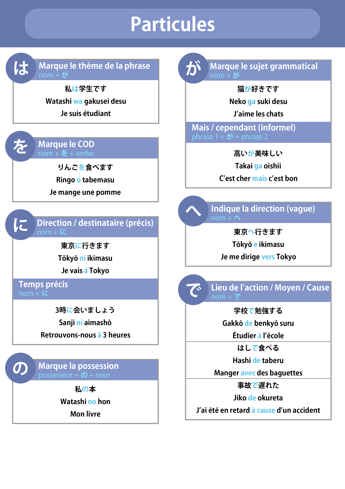
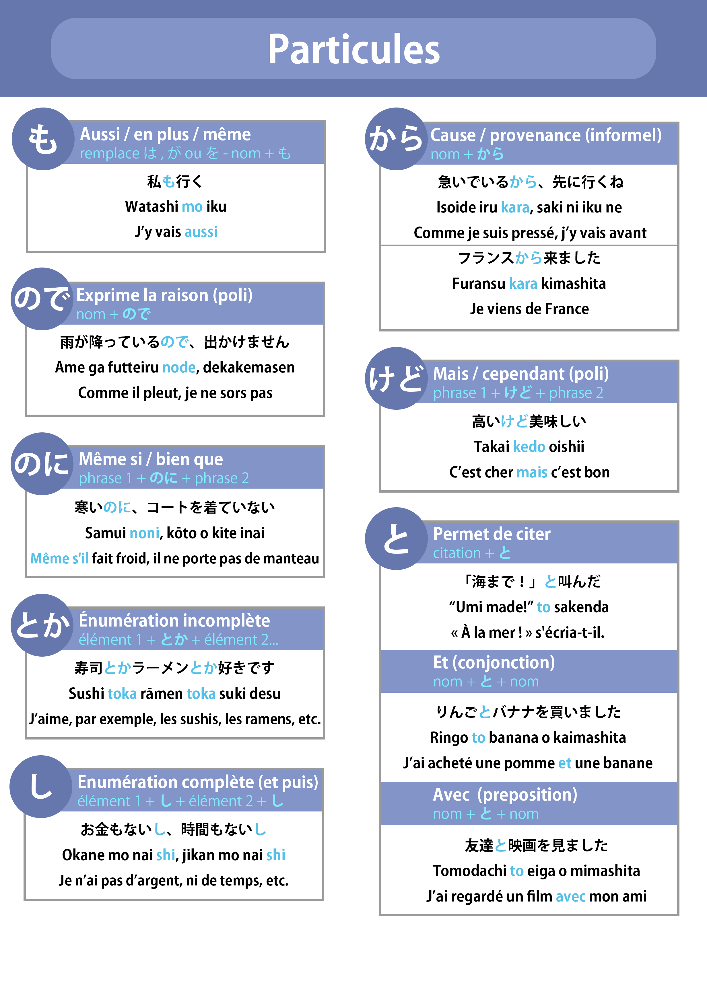
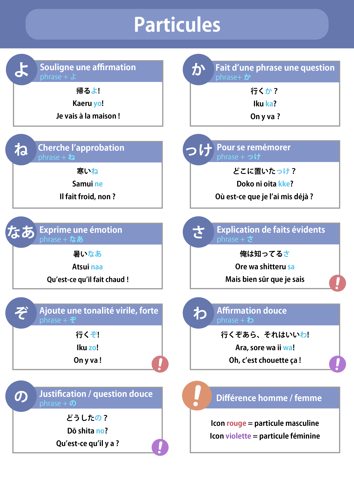
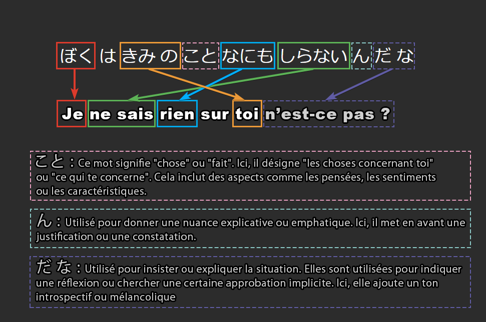

## **Introduction**
Ce post ne contient pas de définitions ni d’explications détaillées. Il s’agit de notes résumées, présentées sous forme de bullet point, davantage conçues comme une cheatsheet (fiche pratique) qu’un cours complet.

## **Kana**

## **Verbes**
Ressource très utile : 
- https://www.japaneseverbconjugator.com/
- https://www.verbix.com/languages/japanese

### Types de verbes 

1. <strong class="alternate">ごだん - Verbes</strong> 
	- Ces verbes se terminent en **-う, -く, -す, -つ, -ぬ, -む, -ぶ, -る** (quand **-る** n’est pas un ichidan).

2. <strong class="alternate">いちだん - Verbes</strong> 
	- Ces verbes se terminent en **-る**, précédé d’un son **い** ou **え**.
	  
3. <strong class="alternate">ふきそく (irrégulier) - Verbes</strong> 
    - On y retrouve **する (faire)**, **くる (venir)**, **いく (aller)** et **ある (avoir, exister - objets inanimés)** dans cette catégorie.

### Conjugaison

<strong class="alternate">ごだん</strong> 

Remplacez la voyelle う (-u) par la voyelle de la colonne correspondante (a, i, e, o) pour ajouter la terminaison voulue (ex. か**う** → か**い**ます、はな**す** → はな**し**ます、つ**く** → つ**き**ます).

|                        | **Affirmatif** | **Négatif** | **Passé aff. -た** | **Passé nég.** | **Forme en -て** |
|------------------------|----------------|-------------|-------------------|----------------|-----------------|
| **Neutre**             |                | ～a ない     | ...た/だ          | ～a なかった   | ...て/で        |
| **Poli**               | ～i ます       | ～i ません   | ～i ました        | ～i ませんでした |                 |

|                        | **Impératif aff.** | **Impératif nég.** | **Imp. aut. aff.** | **Imp. aut. nég.** | **Volonté aff.** |
|------------------------|--------------------|--------------------|--------------------|--------------------|------------------|
| **Neutre**             | ...て              | ～a ないで         | え                 | うな               | ～o う           |
| **Poli**               | ...てください       | ～a ないでください  | ～i なさい          |                    | ～i ましょう     |

|                        | **Potentiel aff.** | **Potentiel nég.** | **Passif aff.**    | **Passif nég.**    | **Causatif aff.** |
|------------------------|--------------------|--------------------|--------------------|--------------------|-------------------|
| **Neutre**             | ～e る             | ～e ない            | ～a れる            | ～a れない          | ～a せる           |
| **Poli**               | ～e ます           | ～e ません           | ～a れます          | ～a れません         | ～a せます          |

|                        | **Causatif nég.**  | **Cond. aff.**     | **Cond. nég.**     | **Cond. aff. tara** | **Cond. nég. tara** |
|------------------------|--------------------|--------------------|--------------------|---------------------|---------------------|
| **Neutre**             | ～a せます          | えば               | ～a なければ         | ...たら             | ～a なかった         |
| **Poli**               | ～a せません         |                    |                    | ～i ましたら        | ～i ませんでしたら    |

<strong class="alternate">いちだん</strong> 

Retirer le る (-ru) et ajouter la terminaison appropriée (ex. たべる → 食べます、みる → みます、おきる → おきます、きる → きます)

Suivez le tableau pour les verbes ごだん mais en ne souciant pas des ～x (il suffit simplement de remplacer る par ce qu'il suit dans le tableau ; ex. できる → できます、できる → できて...)

<strong class="alternate">ふきそく (irrégulier)</strong> 

**する (faire)**

|                        | **Affirmatif** | **Négatif**    | **Passé aff. (-た)** | **Passé nég.**      | **Forme en -て**   |
|------------------------|----------------|----------------|----------------------|---------------------|--------------------|
| **Neutre**             | する           | しない         | した                 | しなかった          | して               |
| **Poli**               | します         | しません       | しました             | しませんでした       | してください       |

|                        | **Impératif aff.** | **Impératif nég.** | **Impératif (aut.) aff.** | **Impératif (aut.) nég.** | **Volonté aff.** |
|------------------------|--------------------|--------------------|---------------------------|---------------------------|------------------|
| **Neutre**             | しろ / せよ       | するな            | しなさい                 | –                         | しよう          |
| **Poli**               | –                  | –                  | –                         | –                         | しましょう      |

|                        | **Potentiel aff.** | **Potentiel nég.** | **Passif aff.**  | **Passif nég.**   | **Causatif aff.** |
|------------------------|--------------------|--------------------|------------------|-------------------|-------------------|
| **Neutre**             | できる             | できない          | される          | されない         | させる           |
| **Poli**               | できます           | できません       | されます        | されません       | させます         |

---

**くる (venir)**

|                        | **Affirmatif** | **Négatif**    | **Passé aff. (-た)** | **Passé nég.**      | **Forme en -て**   |
|------------------------|----------------|----------------|----------------------|---------------------|--------------------|
| **Neutre**             | くる           | こない         | きた                 | こなかった          | きて               |
| **Poli**               | きます         | きません       | きました             | きませんでした       | きてください       |

|                        | **Impératif aff.** | **Impératif nég.** | **Impératif (aut.) aff.** | **Impératif (aut.) nég.** | **Volonté aff.** |
|------------------------|--------------------|--------------------|---------------------------|---------------------------|------------------|
| **Neutre**             | こい              | くるな            | くるなさい               | –                         | こよう          |
| **Poli**               | –                  | –                  | –                         | –                         | きましょう      |

|                        | **Potentiel aff.** | **Potentiel nég.** | **Passif aff.**  | **Passif nég.**   | **Causatif aff.** |
|------------------------|--------------------|--------------------|------------------|-------------------|-------------------|
| **Neutre**             | こられる          | こられない         | こられる        | こられない        | こさせる         |
| **Poli**               | こられます        | こられません       | こられます      | こられません      | こさせます       |

---

**いく (aller)**

> *Note : Bien que **いく** soit un verbe de type godan, il présente quelques irrégularités (notamment pour le passé affirmatif et la forme en -て).*

|                        | **Affirmatif** | **Négatif**    | **Passé aff. (-た)** | **Passé nég.**      | **Forme en -て**   |
|------------------------|----------------|----------------|----------------------|---------------------|--------------------|
| **Neutre**             | いく           | いかない       | いった               | いかなかった        | いって             |
| **Poli**               | いきます       | いきません     | いきました           | いきませんでした     | いってください     |

|                        | **Impératif aff.** | **Impératif nég.** | **Impératif (aut.) aff.** | **Impératif (aut.) nég.** | **Volonté aff.** |
|------------------------|--------------------|--------------------|---------------------------|---------------------------|------------------|
| **Neutre**             | いけ              | いくな            | いきなさい                | –                         | いこう          |
| **Poli**               | –                  | –                  | –                         | –                         | いきましょう    |

|                        | **Potentiel aff.** | **Potentiel nég.** | **Passif aff.**  | **Passif nég.**   | **Causatif aff.** |
|------------------------|--------------------|--------------------|------------------|-------------------|-------------------|
| **Neutre**             | いける             | いけない          | いかれる         | いかれない       | いかせる         |
| **Poli**               | いけます           | いけません        | いかれます       | いかれません     | いかせます       |

---

**ある (avoir, exister pour objets inanimés)**
|                        | **Affirmatif** | **Négatif**  | **Passé aff. (-た)** | **Passé nég.**      | **Forme en -て** |
|------------------------|----------------|--------------|----------------------|---------------------|------------------|
| **Neutre**             | ある           | ない         | あった               | なかった           | あって           |
| **Poli**               | あります       | ありません   | ありました           | ありませんでした     | –                |

## **Adjectifs**
Les adjectifs se divisent en deux grandes catégories : **adjectifs en -い** et **adjectifs en -な**.

### Adjectifs en -い 
- Se terminent toujours par **-い** dans leur forme de base.
- Ils sont intrinsèquement adjectifs et peuvent être utilisés seuls sans particules.

### Adjectifs en -な 
- Ne se terminent pas par **-い** (sauf exceptions comme **きれい**).
- Nécessitent la particule **-な** pour qualifier un nom (la particule -な est uniquement utilisée lorsque l'adjectif précède un nom (forme attributive)).

### Conjugaison

<strong class="alternate">Adjectifs en -い</strong> (ex. たのしい)

| **Forme**               | **Transformation**                        | **Résultat**     |
|-------------------------|-------------------------------------------|------------------|
| **Affirmatif**          | –                                         | たのしい         |
| **Négatif**             | Remplacer **-い** par **-くない**         | たのしくない     |
| **Passé affirmatif**    | Remplacer **-い** par **-かった**         | たのしかった     |
| **Passé négatif**       | Remplacer **-い** par **-くなかった**     | たのしくなかった |

Pour la forme poli, rajoutez simplement です après 

<strong class="alternate">Adjectifs en -な</strong> (ex. しずか (calme))

| **Forme**               | **Transformation**                     | **Résultat**          |
|-------------------------|----------------------------------------|-----------------------|
| **Affirmatif neutre**          | Ajouter **-だ**         | しずかだ              |
| **Affirmatif poli**          | Ajouter **です**              | しずかです              |
| **Négatif neutre**             | Ajouter **-じゃない**                  | しずかじゃない        |
| **Négatif poli**             | Ajouter **-じゃありません** ou (moins utilisé) **-ではない**                 | しずかじゃありません / しずかではありません         |
| **Passé affirmatif neutre**    | Ajouter **-だった**                    | しずかだった          |
| **Passé affirmatif poli**    |   Ajouter **-でした**                 | しずかでした          |
| **Passé négatif neutre**       | Ajouter **-じゃなかった**              | しずかじゃなかった    |
| **Passé négatif poli**       | Ajouter **-じゃありませんでした** ou (moins utilisé) **-ではありませんでした**              | しずかじゃありませんでした / しずかではありませんでした   |

Attention, n'oubliez pas d'ajouter な après l'adjectif s'il qualifie un nom !

### Adjectifs -い en adverbes
Pour transformer un adjectif en **-い** en un **adverbe**, on remplace la terminaison **-い** par **-く**.

| **Adjectif** (-い) | **Adverbe** (-く) | **Traduction**                 |
| ----------------- | ---------------- | ------------------------------ |
| はやい (rapide)      | はやく              | rapidement                     |

### Adjectifs -な en adverbes
Pour transformer un adjectif en **-な** en un **adverbe**, on ne met pas de **な** mais un **に** après **l’adjectif**.

| **Adjectif** (-な) | **Adverbe** (に) | **Traduction** |
| ----------------- | --------------- | -------------- |
| しずかな (calme)      | しずかに            | calmement      |

## **Particules**

Les particules jouent un rôle crucial en japonais : elles servent à marquer les fonctions syntaxiques (sujet, objet, lieu, etc.) et à relier les différentes parties de la phrase. La section suivante détaille chacune d'entre elles afin de vous aider à mieux comprendre leur utilisation et leur importance.

### Particules courantes

<strong class="alternate">は (ha - prononcé wa)</strong> 
- **Fonction principale :** Marque le thème de la phrase, c'est-à-dire ce dont on parle.  
- **Exemple :**  
  - 今日は暑い。 *(Aujourd'hui, il fait chaud.)*  
- **Remarque :** Ne marque pas nécessairement le sujet grammatical, mais l'élément sur lequel porte la phrase.

---

<strong class="alternate">が (ga)</strong>  
- **Fonction principale :** Indique le sujet grammatical (souvent nouveau ou contrasté).  
- **Exemple :**  
  - 猫がいる。 *(Il y a un chat.)*  
- **Nuance informelle :** Peut signifier "mais" ou "cependant" dans des contextes familiers.  
- **Remarque :** Met l'accent sur le sujet plutôt que sur le thème général.

---

<strong class="alternate">を (wo)</strong>  
- **Fonction principale :** Marque le complément d'objet direct (COD) de l'action.  
- **Exemple :**  
  - 本を読む。 *(Lire un livre.)*  
- **Remarque :** Placé juste après le mot qui subit l'action.

---

<strong class="alternate">に (ni)</strong>  
- **Fonction principale :** Indique la direction précise, le destinataire ou un moment spécifique.  
- **Exemples :**  
  - 学校に行く。 *(Aller à l'école.)*  
  - 三時に会う。 *(Se rencontrer à trois heures.)*  
- **Remarque :** Précis par rapport à **へ** qui est plus vague.

---

<strong class="alternate">の (no)</strong>  
- **Fonction principale :** Exprime la possession ou la relation entre deux éléments.  
- **Exemple :**  
  - 彼の本 *(Le livre de lui.)*  
- **Remarque :** Sert aussi à transformer des groupes nominaux en modificateurs.

---

<strong class="alternate">へ (he)</strong> 
- **Fonction principale :** Indique une direction vague, moins précise que **に**.  
- **Exemple :**  
  - 東京へ行く。 *(Aller vers Tokyo.)*  
- **Remarque :** Se prononce **e** même si écrit **へ**.

---

<strong class="alternate">で (de)</strong> 
- **Fonction principale :** Marque le lieu de l'action, le moyen utilisé, ou la cause.  
- **Exemples :**  
  - バスで行く。 *(Aller en bus.)*  
  - 学校で勉強する。 *(Étudier à l'école.)*  
- **Remarque :** Polyvalente pour exprimer le contexte de l'action.

---

<strong class="alternate">も (mo)</strong> 
- **Fonction principale :** Signifie "aussi", "en plus", ou "même", ajoutant un élément similaire.  
- **Exemple :**  
  - 私も行く。 *(Moi aussi, j’y vais.)*  
- **Remarque :** Peut insister sur l'inclusion ou l'exagération.

---

<strong class="alternate">ので (node)</strong>  
- **Fonction principale :** Exprime la cause ou la raison de façon polie.  
- **Exemple :**  
  - 雨が降っているので、出かけません。 *(Comme il pleut, je ne sors pas.)*  
- **Remarque :** Utilisé dans des contextes formels pour justifier une action.

---

<strong class="alternate">のに (noni)</strong>  
- **Fonction principale :** Exprime une contradiction ou une opposition, souvent avec une nuance de déception.  
- **Exemple :**  
  - 一生懸命勉強したのに、試験に落ちた。 *(Même si j'ai étudié dur, j'ai échoué à l'examen.)*  
- **Remarque :** Traduit par "bien que" ou "même si".

---

<strong class="alternate">とか (toka)</strong>  
- **Fonction principale :** Énumération incomplète ou donner des exemples.  
- **Exemple :**  
  - 果物とか野菜とか買いました。 *(J’ai acheté des fruits, des légumes, etc.)*  
- **Remarque :** Implique qu'il y a d'autres éléments similaires.

---

<strong class="alternate">し (shi)</strong> 
- **Fonction principale :** Énumérer plusieurs faits ou raisons de manière cumulative.  
- **Exemple :**  
  - 彼は親切だし、面白いし、頼りになる。 *(Il est gentil, amusant et fiable.)*  
- **Remarque :** Utilisé pour renforcer une affirmation avec plusieurs arguments.

---

<strong class="alternate">から (kara)</strong>
- **Fonction principale :** Exprime la cause, la raison, ou l'origine, souvent informelle.  
- **Exemple :**  
  - 寒いから、外に出たくない。 *(Il fait froid, donc je ne veux pas sortir.)*  
- **Remarque :** Peut également indiquer l'origine géographique ou temporelle.

---

<strong class="alternate">けど (kedo)</strong>
- **Fonction principale :** Marque une concession ou opposition, souvent traduit par "mais" ou "cependant" dans un registre poli.  
- **Exemple :**  
  - 行きたいけど、時間がない。 *(Je veux y aller, mais je n'ai pas le temps.)*  
- **Remarque :** Adoucit l'affirmation tout en signalant un contraste.

---

<strong class="alternate">と (to)</strong>
- **Fonction principale :**  
  - Sert à citer ou rapporter des paroles.  
  - Utilisé pour énumérer des éléments ("et").  
- **Exemples :**  
  - 彼は「行く」と言った。 *(Il a dit "j’y vais".)*  
  - リンゴとバナナを買った。 *(J'ai acheté des pommes et des bananes.)*  
- **Remarque :** Très polyvalente, elle s'adapte selon le contexte.

---

<strong class="alternate">よ (yo)</strong> 
- **Fonction principale :** Particule finale qui renforce une affirmation ou signale une information nouvelle.  
- **Exemple :**  
  - これは本当だよ。 *(C’est vraiment vrai, tu sais.)*  
- **Remarque :** Met l'accent sur ce que l'on affirme.

---

<strong class="alternate">ね (ne)</strong> 
- **Fonction principale :** Cherche l'approbation ou la confirmation, équivalent à "n'est-ce pas ?".  
- **Exemple :**  
  - いい天気ですね。 *(Il fait beau, n'est-ce pas ?)*  
- **Remarque :** Crée une connivence entre les interlocuteurs.

---

<strong class="alternate">なあ (naa)</strong>
- **Fonction principale :** Exprime une émotion ou une réflexion personnelle, souvent avec nostalgie.  
- **Exemple :**  
  - もう帰りたいなあ。 *(J’ai vraiment envie de rentrer…)*  
- **Remarque :** Utilisée dans des contextes informels pour exprimer des sentiments.

---

<strong class="alternate">か (ka)</strong> 
- **Fonction principale :** Transforme la phrase en question.  
- **Exemple :**  
  - これは何ですか？ *(Qu'est-ce que c'est ?)*  
- **Remarque :** Indispensable pour poser des questions en japonais.

---

<strong class="alternate">っけ (kke)</strong> 
- **Fonction principale :** Utilisée pour se rappeler ou vérifier une information oubliée.  
- **Exemple :**  
  - 彼の名前は何だったっけ？ *(Comment s’appelait-il déjà ?)*  
- **Remarque :** Courant dans les conversations informelles.

---

<strong class="alternate">さ (sa)</strong> 
- **Fonction principale :** Particule finale familière, souvent masculine, qui souligne un fait évident.  
- **Exemple :**  
  - それは当たり前さ。 *(C’est évident, voyons !)*  
- **Remarque :** Donne un ton plus décontracté et assertif.

---

<strong class="alternate">ぞ (zo)</strong>
- **Fonction principale :** Ajoute une tonalité virile et affirmée, exprimant une forte assurance.  
- **Exemple :**  
  - 行くぞ！ *(On y va !)*  
- **Remarque :** Typiquement masculin et familier.

---

<strong class="alternate">わ (wa)</strong> 
- **Fonction principale :** Particule finale à connotation douce, souvent féminine, qui adoucit l'affirmation.  
- **Exemple :**  
  - 今日は楽しいわ。 *(Aujourd'hui, c'est agréable.)*  
- **Remarque :** Souvent utilisée dans un registre intime ou familier.

---

<strong class="alternate">の (no)</strong> (en fin de phrase)  
- **Fonction principale :**  
  - Justifie une situation ou pose une question de manière douce.  
- **Exemples :**  
  - どうして来なかったの？ *(Pourquoi n'es-tu pas venu(e) ?)*  
  - これは私の本なの。 *(C’est mon livre, tu sais.)*  
- **Remarque :** Souvent utilisée pour adoucir les phrases ou les questions, avec une nuance féminine.

### Fiches de révision

### Structure ～か～

La structure **～か～** est utilisée pour intégrer une question au sein d'une phrase principale. Elle permet de poser des questions indirectes ou d'exprimer des incertitudes, des doutes ou des interrogations internes.

| **Structure**           | **Signification principale**                         | **Exemple**                            | **Explication**                                                                                      |
|-------------------------|------------------------------------------------------|----------------------------------------|------------------------------------------------------------------------------------------------------|
| **～か～**              | Question indirecte / Interrogation intégrée          | なにをした**か**わかりますか？         | Intègre une question ("Qu'est-ce qu'il a fait ?") au sein d'une phrase principale ("Comprends-tu  "), ce qui donne "comprends-tu ce qu'il a fait ?"         |

---

## **Formes et constructions verbales**

### Forme en -て
La forme en **-て** est utilisée pour connecter des phrases ou des idées, exprimer une action en progression ou enchaîner des actions. Elle sert également à donner des instructions et à former des constructions grammaticales plus complexes (par exemple : 〜ている, 〜てから, 〜ても, etc.).

**Adjectifs**

<strong class="alternate">Adjectifs en -い</strong>  
Pour les adjectifs en **-い**, remplacez **-い** par **-くて**.

| **Adjectif** (-い) | **Te-form** (-くて) | **Traduction**         |
| ----------------- | ------------------ | ---------------------- |
| たのしい          | たのしくて         | amusant et…            |
| はやい           | はやくて           | rapide et…             |
| ちいさい          | ちいさくて         | petit et…              |

<strong class="alternate">Adjectifs en -な</strong>  
Pour les adjectifs en **-な**, ajoutez simplement **で** après l’adjectif.

| **Adjectif** (-な) | **Te-form** (で) | **Traduction**       |
| ----------------- | -------------- | -------------------- |
| しずかな          | しずかで         | calme et…            |
| ていねいな         | ていねいで        | poli et…             |

*Exemple d’usage pour un adjectif en -い :*  
「このえいがは たのしくて、ぜんたいで おもしろい。」  
*(Ce film est amusant et dans l'ensemble intéressant.)*

**Verbes**

<strong class="alternate">Verbes du groupe ごだん</strong> 

| **Terminaison du verbe** | **Te-form** | **Exemple** (Dictionnaire → Te-form)       |
| ------------------------ | ----------- | ------------------------------------------ |
| -う, -つ, -る           | -って       | かう → かって  *(acheter)*                    |
| -む, -ぶ, -ぬ           | -んで       | よむ → よんで  *(lire)*                       |
| -く                     | -いて       | かく → かいて  *(écrire)*                     |
| -ぐ                     | -いで       | およぐ → およいで  *(nager)*                  |
| -す                     | -して       | はなす → はなして  *(parler)*                 |

<strong class="alternate">Verbes du groupe いちだん</strong>  
Enlevez **-る** et ajoutez **-て**.

| **Verbe**         | **Te-form** |
| ----------------- | ----------- |
| たべる (manger)   | たべて     |
| みる (voir)       | みて       |

<strong class="alternate">Verbes irréguliers ふきそく</strong> 

| **Verbe**         | **Te-form** |
| ----------------- | ----------- |
| する (faire)      | して       |
| くる (venir)      | きて       |

*Exemple d’usage pour un verbe :*  
「てがみを かいて、ゆうびんで おくります。」  
*(J'écris une lettre et je l'envoie par la poste.)*

---

### Structure 〜ている & 〜てある

La construction **〜ている** peut exprimer différentes nuances selon le contexte :
- action en cours (progressif)
- action habituelle 
- état résultant d'une action passée

La construction **〜てある** quant à elle, est utilisée pour décrire un **état résultant** d'une action intentionnelle, souvent réalisée par quelqu'un pour que quelque chose reste dans un certain état.

| **Expression** | **Usage / Nuance**                                      | **Exemple**                  | **Traduction / Explication**                                                                 |
|----------------|---------------------------------------------------------|------------------------------|---------------------------------------------------------------------------------------------|
| 〜ている       | Action en cours (progressif)                            | りょうりをしている            | Je suis en train de cuisiner (action qui se déroule actuellement)                             |
| 〜ている       | Action habituelle                                       | まいあさあるいている          | Je marche tous les matins (action répétée ou une habitude)                                    |
| 〜ている       | État résultant d'une action passée                      | ドアがあいている              | La porte est ouverte (résultat d'une action antérieure, sans impliquer une intention particulière) |
| 〜てある       | État résultant d'une action intentionnelle              | テーブルの上に本が置いてある  | Un livre est posé sur la table (l'action a été réalisée exprès pour maintenir cet état)        |

**Différence principale :**  
- **〜ている** décrit une action en cours, une habitude ou un état résultant sans insistance sur l'intention derrière l'action.  
- **〜てある** met l'accent sur le fait que l'action a été **intentionnellement** réalisée afin de créer et de maintenir un état particulier.

---

### Structure ～ておく

La construction **〜ておく** est utilisée pour indiquer qu'une action est réalisée en prévision de quelque chose, c'est-à-dire pour se préparer ou anticiper un événement futur. Elle exprime l'idée de faire quelque chose à l'avance pour faciliter ou garantir le bon déroulement de situations ultérieures.

| **Structure**              | **Usage / Nuance**                                                        | **Exemple**                           | **Traduction / Explication**                                                               |
|----------------------------|---------------------------------------------------------------------------|---------------------------------------|--------------------------------------------------------------------------------------------|
| Verbe (forme en -て) + おく | Indique qu'une action est effectuée en prévision ou par mesure de précaution  | 宿題をしておく                        | "Je fais mes devoirs à l'avance"   (pour éviter d'être pressé plus tard)                |
|                            |                                                                           | 部屋を片付けておく                     | "Je range la chambre en prévision de l'arrivée d'invités"                                   |

---

### Structure ～てみる

La construction **〜てみる** est utilisée pour exprimer l'idée d'**essayer de faire quelque chose afin de voir ce que ça donne**. Elle combine la **forme en -て** d'un verbe avec **みる** (voir), indiquant ainsi une tentative ou une expérience.

| **Structure**               | **Usage / Nuance**                                               | **Exemple**                          | **Traduction / Explication**                                            |
|-----------------------------|------------------------------------------------------------------|--------------------------------------|-------------------------------------------------------------------------|
| Verbe (forme en -て) + みる  | Essayer de faire une action pour en observer les résultats         | 食べてみる                           | "Essayer de manger"   (faire un essai pour voir si c'est bon)          |
|                             |                                                                  | 行ってみる                           | "Essayer d'aller"   (se rendre quelque part pour voir ce que ça donne)   |

---

### Structure ～ていく / ～てくる

Les constructions **～ていく** et **～てくる** sont utilisées pour exprimer la direction ou la temporalité d'une action. Elles ajoutent des nuances supplémentaires en indiquant si l'action se dirige vers l'extérieur ou vers le locuteur, ou si elle se déroule dans le futur ou est déjà en cours.

| **Aspect**             | **～ていく (te iku)**                       | **～てくる (te kuru)**                        |
|------------------------|---------------------------------------------|-----------------------------------------------|
| **Direction**          | Vers l'extérieur, s'éloigne                 | Vers le locuteur, revient                      |
| **Temporalité**        | Action qui continue dans le futur           | Action qui a commencé dans le passé et continue |
| **Exemples**           | はしっていく   (Il va courir plus loin)        | たべてくる   (Il vient manger)               |
| **Changement Progressif** | Peut indiquer un changement qui évolue dans le futur | Peut indiquer un changement qui a évolué jusqu'à maintenant |

Exemple : 
| **Phrase**          | **Traduction / Explication**                         |
|---------------------|-------------------------------------------------------|
| たべてくる          | "Il vient manger." (Manger en venant vers le locuteur) |
| はしってくる        | "Il vient courir." (Courir en revenant vers le locuteur) |
| よんできた          | "Il est venu lire." (Lire en venant vers le locuteur) |

---

### Structure てしまう

Cela permet d'exprimer un **sentiment de regret** ou le fait que quelque chose s’est produit **par accident** ou **malencontreusement**.

*Exemple :*  
「わすれてしまった。」  
*J’ai **oublié** (par accident)*

<strong class="alternate">Construction</strong> 

- Verbe en **て** + しまう  
- Verbe en **で** + しまう

Il existe aussi la forme **contractée informelle**. 

<strong class="alternate">Construction</strong> 

- on remplace ～てしまう par **ちゃう**  
- on remplace ～でしまう par **じゃう**

*Exemple :*  
「わすれちゃう。」  
*J’ai **oublié** (par accident)*

「のんじゃう。」  
*J’ai **bu** (par accident)*

---

### Structure ～たり / ～たりする
Elle permet d'exprimer que l’on fait plusieurs actions, entre autres, sans les énumérer toutes Cette construction veut dire « faire ceci, faire cela, etc. »

Cette structure est : 
- **Non exhaustif** : La structure indique qu’il y a d’autres actions qui pourraient être faites.
- **Utiliser la forme passée + り** pour chaque verbe.
- **Terminer par する** pour signifier que c’est l’action principale.

<strong class="alternate">Construction</strong> 
1. Choisir un verbe que vous voulez utiliser.  
   Par exemple :  
   - たべる (manger)  
   - のむ (boire)

2. Conjuguer le verbe à la forme passée (forme en **た**).  
   - たべる → **たべた**  
   - のむ → **のんだ**

3. Ajouter り après le verbe à la forme passée.
   - たべた → **たべたり**  
   - のんだ → **のんだり**

4. Terminer avec する pour conclure la série.  
   - Exemple complet : **たべたり のんだり する**

| **Expression**         | **Usage / Nuance**                                          | **Exemple**                         | **Traduction / Explication**                                                                 |
|------------------------|-------------------------------------------------------------|-------------------------------------|----------------------------------------------------------------------------------------------|
| 〜たり〜たりする       | Énumération non exhaustive d'actions                        | たべたり　のんだり　する              | "Je fais des choses comme manger et boire, entre autres"                                     |
|                        | Permet de donner des exemples sans lister toutes les actions |                                     | Indique que d'autres actions peuvent être faites en plus des exemples donnés.                |

---

### Concept + する
De nombreux noms en japonais représentent des idées ou des actions. En ajoutant **する** après ces noms, on crée un verbe qui exprime l’action liée au concept.

**Formation** : 
1. **Prendre un nom** (souvent en hiragana ou katakana) qui représente une idée ou un concept.  
   Par exemple :  
   - べんきょう (étude)  
   - よやく (réservation)  
   - うんどう (exercice)  
   - そうだん (consultation/discussion)

2. **Ajouter する** après le nom pour créer un verbe.  
   - べんきょう → **べんきょうする** (étudier)  
   - よやく → **よやくする** (réserver)  
   - うんどう → **うんどうする** (faire de l’exercice)  
   - そうだん → **そうだんする** (consulter/discuter)

| **Expression**          | **Usage / Nuance**                                          | **Exemple**                         | **Traduction / Explication**                                                                 |
|-------------------------|-------------------------------------------------------------|-------------------------------------|----------------------------------------------------------------------------------------------|
| Nom + する             | Transformation d’un nom (souvent abstrait ou concept) en verbe  | べんきょうする よやくする         | "Étudier" "Réserver"                                                                         |
|                         | Permet de créer facilement un verbe d'action à partir d'un concept ou d'une idée | うんどうする そうだんする         | "Faire de l'exercice" "Consulter / Discuter"                                               |

---

### Structure 〜たことがある

L'expression **「〜たことがある」** est utilisée pour indiquer qu'on a déjà fait quelque chose ou qu'une certaine expérience s'est produite dans le passé.

| **Structure**          | **Usage**                                                        | **Exemple**                      | **Traduction / Explication**                  |
|------------------------|------------------------------------------------------------------|----------------------------------|-----------------------------------------------|
| Verbe (forme passée た-forme) + ことがある | Exprime qu'une action a été réalisée au moins une fois             | たべたことがある                 | "J'ai déjà mangé."  |

---

### Forme potentielle

La **forme potentielle** sert à exprimer :
- **La capacité** (pouvoir faire quelque chose)
- **La possibilité** (être en mesure de faire quelque chose)

En japonais, la capacité de faire certaines actions est exprimée en conjugant le verbe plutôt qu'en ajoutant un mot comme "pouvoir" ou "être capable" comme en français. 

Tous les verbes, une fois conjugués dans leur forme potentielle, deviennent un verbe-ru.

Les règles peuvent se diviser en deux groupes principaux : les verbes-ru et les verbes-u. La forme potentielle du verbe 「する」 est un cas spécial car il devient un tout autre verbe : 「できる」

<strong class="alternate">Construction</strong> 

- Verbes en "ru" : Remplacer le 「**る**」 par 「**られる**」
- Verbes en "u" : Changer le dernier caractère d'une voyelle "u" en son équivalent "e" et ajouter 「**る**」.
- Exceptions : 「する」 devient 「できる」 et 「くる」 devient 「こられる」.

<strong class="alternate">Exemples de verbes en -る</strong> 

| **Normal** | **Potentiel** |
| ---------- | ------------- |
| たべる     | たべられる     |
| きる       | きられる       |
| しんじる   | しんじられる   |
| ねる       | ねられる       |
| おきる     | おきられる     |
| でる       | でられる       |
| かける     | かけられる     |

<strong class="alternate">Exemples de verbes en -う</strong> 

| **Normal** | **Potentiel** | **ローマじ** | **ローマじ (Pot.)** |
| ---------- | ------------- | ----------- | ------------------- |
| はなす     | はなせる       | hanasu      | hanaseru            |
| かく       | かける         | kaku        | kakeru              |
| あそぶ     | あそべる       | asobu       | asoberu             |
| まつ       | まてる         | matu        | materu              |
| のむ       | のめる         | nomu        | nomeru              |
| とる       | とれる         | toru        | toreru              |
| しぬ       | しねる         | shinu       | shineru             |

<strong class="alternate">Exceptions</strong> 

| **Normal** | **Potentiel** |
| ---------- | ------------- |
| する       | できる         |
| くる       | こられる       |

---

## **Niveaux de langage (politesse)** 

### Teineigo 

| Forme             | Présent | Passé | Négatif | Passé négatif |
| ----------------- | ------- | ----- | ------- | ------------- |
| **Polie**         | -ます     | -ました  | -ません    | -ませんでした       |
| **Exemple (かく)**  | かきます    | かきました | かきません   | かきませんでした      |
| **Exemple (たべる)** | たべます    | たべました | たべません   | たべませんでした      |

Selon les types de verbe : 

|Groupe|Particularité|Exemple (-ます)|
|---|---|---|
|**ごだん**|La dernière syllabe change.|かく → かきます|
|**いちだん**|Radical stable, ajoute simplement -ます.|たべる → たべます|
|**ふきそく**|Formes uniques et spécifiques.|する → します, くる → きます|

Tips : 
- Si le verbe se termine par **る** après une voyelle (い ou え) → **いちだん**.
- Si le verbe se termine par autre chose que **る**, ou par **る** mais avec une consonne (ex. かる) → **ごだん**.
- Si c’est **する** ou **くる**, ce sont les irréguliers

### Suffixes de politesse

| **Suffixe** | **Usage**                                                                                                                           | **Exemple**                |
| ----------- | ----------------------------------------------------------------------------------------------------------------------------------- | -------------------------- |
| **さん**      | Neutre et poli. Utilisé pour s'adresser à une personne respectueusement (équivalent de "Monsieur/Madame").                          | たなかさん (M./Mme Tanaka)      |
| **さま**      | Très formel et respectueux. Utilisé pour les clients, la correspondance formelle, ou envers des divinités.                          | おきゃくさま (cher client)       |
| **くん**      | Utilisé pour s'adresser à un garçon ou un homme jeune. Peut aussi être utilisé par des supérieurs envers des subordonnés masculins. | たろうくん (Taro, garçon)       |
| **ちゃん**     | Familier et affectueux. Utilisé pour les enfants, les amis proches ou en termes affectueux.                                         | みきちゃん (Miki, petite fille) |
| **せんぱい**    | Pour s'adresser à un supérieur ou à quelqu’un avec plus d’expérience (école, travail, etc.).                                        | たなかせんぱい (senpai Tanaka)    |
| **し**       | Forme neutre et impersonnelle, souvent utilisée dans les écrits officiels ou académiques.                                           | たなかし (M./Mme Tanaka)       |
| **どの**      | Très formel, utilisé dans les correspondances officielles ou dans des contextes anciens.                                            | たなかどの (M./Mme Tanaka)      |
- Toujours commencer par **さん** dans un contexte inconnu ou formel.
- Passer à **くん** ou **ちゃん** uniquement si la relation est proche ou que la situation le permet.
- Utiliser **さま** ou **どの** dans des contextes très formels ou spécifiques.

## **Vocabulaire et expressions**

### Vocabulaire famille

| Japonais (hiragana)   | フランスご                 |
|-----------|-----------------------|
| ちち (familier)      | père                       |
| おとうさん (poli)     | père                       |
| はは (familier)       | mère                       |
| おかあさん (poli)     | mère                       |
| あに (familier)       | frère aîné                 |
| おにいさん (poli)     | frère aîné                 |
| あね (familier)       | sœur aînée                 |
| おねえさん (poli)     | sœur aînée                 |
| おとうと              | petit frère                |
| いもうと              | petite sœur               |
| そふ (familier)       | grand-père                 |
| おじいさん (poli)     | grand-père                 |
| そぼ (familier)       | grand-mère                 |
| おばあさん (poli)     | grand-mère                 |
| おじ                  | oncle                      |
| おば                  | tante                      |
| いとこ                | cousin / cousine           |

### Mots interrogatifs

Les mots interrogatifs de base :

| Mot         | Traduction          |
| ----------- | ------------------- |
| **だれ**      | Qui                 |
| **なに / なん** | Quoi / Que          |
| **いつ**      | Quand               |
| **どこ**      | Où                  |
| **どれ**      | Lequel              |
| **いくら**     | Combien (prix)      |
| **どう**      | Comment             |
| **なんで**     | Pourquoi (familier) |
| **どうして**    | Pourquoi            |
| **なぜ**      | Pourquoi (formel)   |

Les variations avec les particules :

<strong class="alternate">Récap</strong> 

|Particule|Sens principal|Exemple|
|---|---|---|
|**+か**|Une possibilité / une incertitude|どこかに行きたい。 → Je veux aller quelque part.|
|**+も**|Tout (positif) / Aucun (négatif)|なにもありません。 → Il n’y a rien.|
|**+でも**|N’importe lequel / une généralité|いつでもいいです。 → N’importe quand ça va.|

<strong class="alternate">Détails</strong> 
Avec **+か** (indique l'incertitude ou une question indirecte)

|Mot de base|Avec +か|Traduction|
|---|---|---|
|**だれ**|**だれか**|Quelqu’un|
|**なに**|**なにか**|Quelque chose|
|**いつ**|**いつか**|Un jour / à un moment|
|**どこ**|**どこか**|Quelque part|
|**どれ**|**どれか**|L’un de ceux-là|
 Avec +**も** (indique l’exhaustivité ou la négation selon le contexte)

|Mot de base|Avec +も|Traduction|
|---|---|---|
|**だれ**|**だれも**|Tout le monde (positif) / Personne (négatif)|
|**なに**|**なにも**|Tout (positif) / Rien (négatif)|
|**いつ**|**いつも**|Toujours (positif) / Jamais (négatif)|
|**どこ**|**どこも**|Partout (positif) / Nulle part (négatif)|
|**どれ**|**どれも**|Tous (positif) / Aucun (négatif)|
Avec +**でも** (indique une possibilité ou une généralité)

|Mot de base|Avec +でも|Traduction|
|---|---|---|
|**だれ**|**だれでも**|N’importe qui|
|**なに**|**なにでも**|N’importe quoi|
|**いつ**|**いつでも**|N’importe quand|
|**どこ**|**どこでも**|N’importe où|
|**どれ**|**どれでも**|N’importe lequel|

### Expressions de localisation

| Mot               | Définition | Distance locuteur | Distance l'auditeur |
| ----------------- | ---------- | ----------------- | ------------------- |
| **ここ**            | Ici        | Proche            | Indifférent         |
| **あちら** / **あっち** | Par-là     | Loin              | Loin                |
| **そちら** / **そっち** | Par-là     | Loin              | Proche              |
| **こちら** / **こっち** | Par ici    | Proche            | Indifférent         |

| Mot    | Définition    | Distance locuteur | Distance auditeur |
| ------ | ------------- | ----------------- | ----------------- |
| **この** | Ce... (objet) | Proche            | Indifférent       |
| **その** | Ce... (objet) | Indifférent       | Proche            |
| **あの** | Ce... (objet) | Loin              | Loin              |
| **これ** | Ceci          | Proche            | Indifférent       |
| **それ** | Cela          | Indifférent       | Proche            |
| **あれ** | Cela là-bas   | Loin              | Loin              |

## **Autres**

### Être / avoir
| Concept                                             | Forme              | Niveau de politesse | Utilisation                                                     | Exemple                                                                      |
| --------------------------------------------------- | ------------------ | ------------------- | --------------------------------------------------------------- | ---------------------------------------------------------------------------- |
| **Présence/Existence d'un objet inanimé**           | **ある (aru)**       | Neutre / familier   | Indique qu'un objet existe quelque part                         | 机の上に本がある (Tsukue no ue ni hon ga aru) - "Il y a un livre sur la table"       |
| **Présence/Existence d'un objet inanimé**           | **あります (arimasu)** | Poli                | Indique qu'un objet existe quelque part                         | 机の上に本があります (Tsukue no ue ni hon ga arimasu) - "Il y a un livre sur la table" |
| **Présence/Existence d'un être vivant**             | **いる (iru)**       | Neutre / familier   | Indique qu'une personne ou un animal existe quelque part        | 公園に犬がいる (Kouen ni inu ga iru) - "Il y a un chien dans le parc"               |
| **Présence/Existence d'un être vivant**             | **います (imasu)**    | Poli                | Indique qu'une personne ou un animal existe quelque part        | 公園に犬がいます (Kouen ni inu ga imasu) - "Il y a un chien dans le parc"            |
| **Identité/Description** (Nom ou Adjectif en **な**) | **だ (da)**         | Neutre / familier   | Relie un nom ou un adjectif au sujet pour identifier ou décrire | これは本だ (Kore wa hon da) - "Ceci est un livre"                                 |
| **Identité/Description** (Nom ou Adjectif en **な**) | **です (desu)**      | Poli                | Relie un nom ou un adjectif au sujet pour identifier ou décrire | これは本です (Kore wa hon desu) - "Ceci est un livre"                              |
| **Description avec Adjectif en い**                  | Pas de **だ**       | Neutre / familier   | Pas de copule nécessaire, l'adjectif seul est complet           | この山は高い (Kono yama wa takai) - "Cette montagne est haute"                     |
| **Description avec Adjectif en い**                  | **です (desu)**      | Poli                | Ajoute de la politesse à un adjectif en **い** (optionnel)       | この山は高いです (Kono yama wa takai desu) - "Cette montagne est haute"              |

### Articulation des phrases

